# Phase 1.5: Visual Designs & UI Wireframes

**Version:** 1.0
**Last Updated:** January 2025
**Status:** Planning

---

## Table of Contents

1. [System Architecture Diagrams](#system-architecture-diagrams)
2. [Data Flow Diagrams](#data-flow-diagrams)
3. [UI Wireframes](#ui-wireframes)
4. [Component Interaction Diagrams](#component-interaction-diagrams)
5. [User Workflows](#user-workflows)

---

## System Architecture Diagrams

### High-Level System Architecture

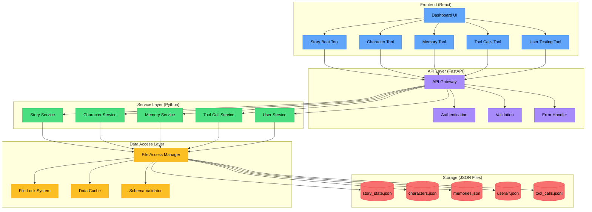

### Component Dependency Graph

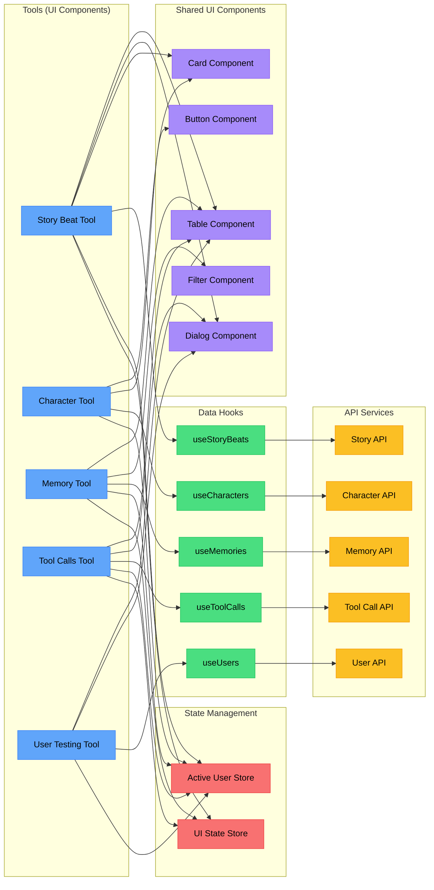

---

## Data Flow Diagrams

### Read Operation Flow

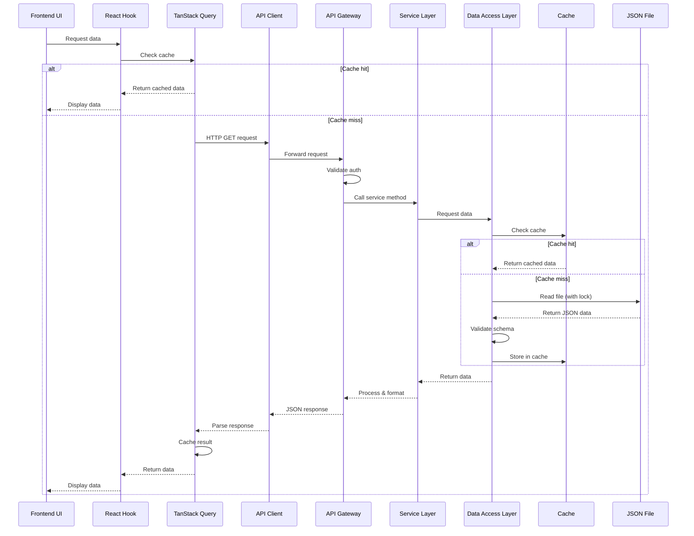

### Write Operation Flow

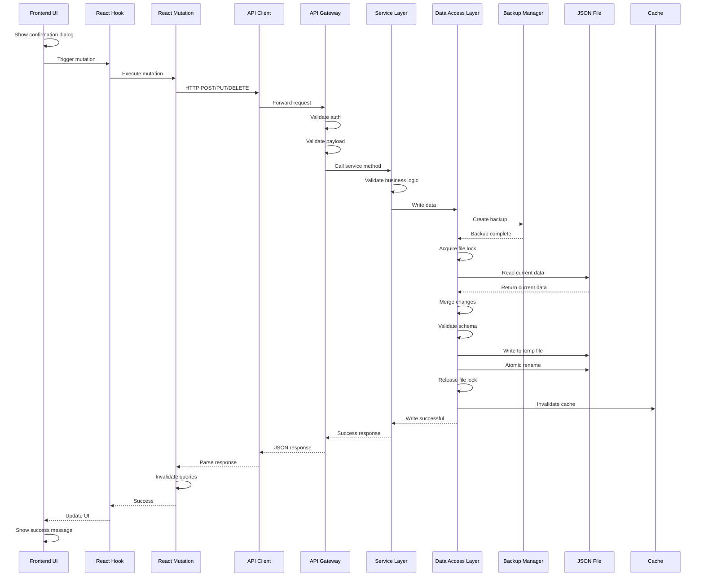

### User Switching Flow

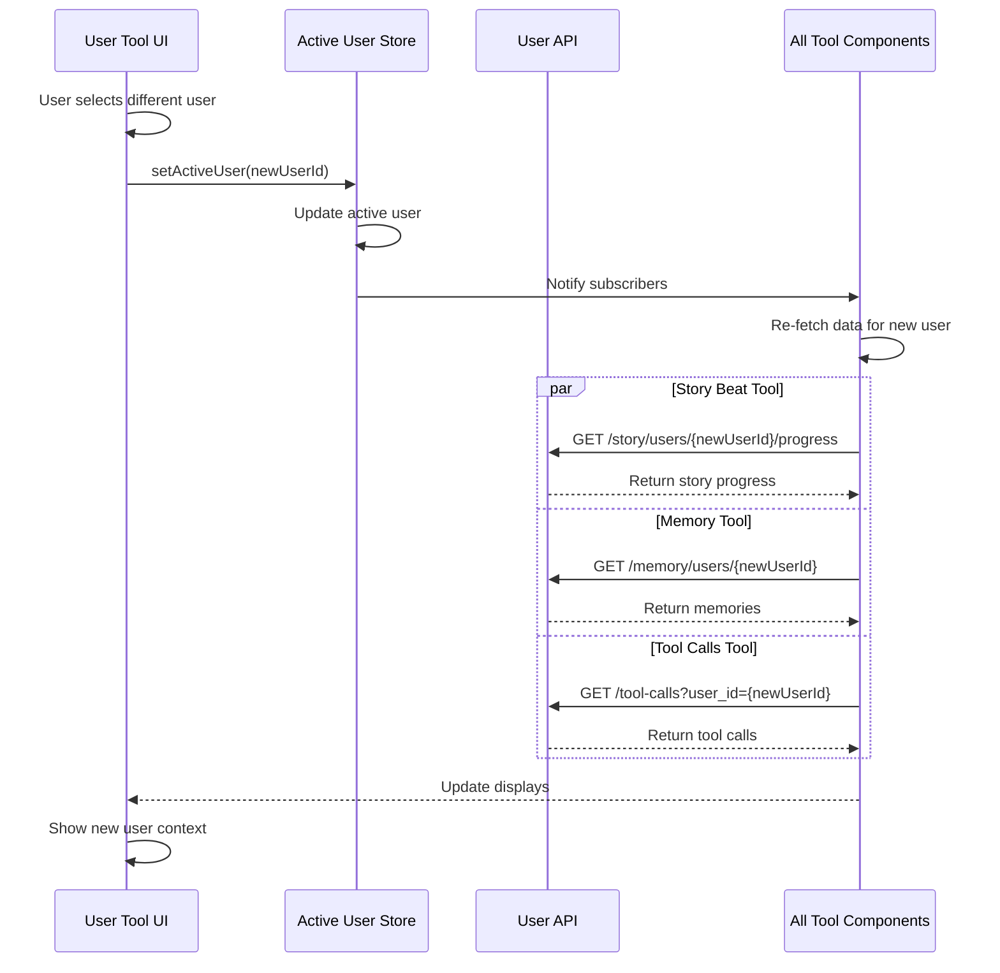

---

## UI Wireframes

### Dashboard Home

```
┌────────────────────────────────────────────────────────────────────────┐
│  Hey Chat! Observability Dashboard                    [Active User: ▼] │
├────────────────────────────────────────────────────────────────────────┤
│                                                                          │
│  ┌──────────────┐  ┌──────────────┐  ┌──────────────┐  ┌────────────┐ │
│  │ Story Beat   │  │  Character   │  │   Memory     │  │ Tool Calls │ │
│  │    Tool      │  │     Tool     │  │    Tool      │  │    Tool    │ │
│  │              │  │              │  │              │  │            │ │
│  │  📖 View     │  │  👤 Inspect  │  │  🧠 Manage   │  │  🔧 Debug  │ │
│  │  story beats │  │  character   │  │  user        │  │  tool      │ │
│  │  and chapter │  │  configs &   │  │  memories    │  │  execution │ │
│  │  progression │  │  prompts     │  │  & context   │  │  history   │ │
│  │              │  │              │  │              │  │            │ │
│  │  [Open →]    │  │  [Open →]    │  │  [Open →]    │  │  [Open →]  │ │
│  └──────────────┘  └──────────────┘  └──────────────┘  └────────────┘ │
│                                                                          │
│  ┌──────────────┐                                                       │
│  │ User Testing │                                                       │
│  │    Tool      │     Current User Context:                            │
│  │              │     • User: Justin (user_justin)                     │
│  │  👥 Create   │     • Chapter: Chapter 1 - Awakening                 │
│  │  test users, │     • Progress: 5/8 beats (62%)                      │
│  │  switch      │     • Memories: 23 items                             │
│  │  contexts    │     • Last interaction: 2 hours ago                  │
│  │              │                                                       │
│  │  [Open →]    │                                                       │
│  └──────────────┘                                                       │
│                                                                          │
└────────────────────────────────────────────────────────────────────────┘
```

### Story Beat Tool - Main View

```
┌────────────────────────────────────────────────────────────────────────┐
│  📖 Story Beat Tool                         Active User: Justin [▼]    │
├────────────────────────────────────────────────────────────────────────┤
│                                                                          │
│  [All Chapters ▼] [All Status ▼]  🔍 [Search beats...]  [Change Chapter]│
│                                                                          │
├──────────────────┬────────────────────────────────────────────────────┤
│                  │                                                      │
│  Chapter 1       │  Chapter 1: Awakening                   [Flow View] │
│  ● Awakening     │                                                      │
│    (5/8 beats)   │  Progress: ████████░░░░░░ 62% (5 of 8 beats)        │
│                  │  Required beats: 3/5 complete                        │
│  Chapter 2       │                                                      │
│  ○ Teamwork      │  Story Beats:                                        │
│    (locked)      │                                                      │
│                  │  ┌──────────────────────────────────────────────┐  │
│  Chapter 3       │  │ ✅ awakening_confusion (REQUIRED)             │  │
│  ○ Purpose       │  │    First Confusion                            │  │
│    (locked)      │  │    Delivered: Jan 15, 2025                    │  │
│                  │  │    [View Details] [Preview Content]           │  │
│                  │  └──────────────────────────────────────────────┘  │
│                  │                                                      │
│                  │  ┌──────────────────────────────────────────────┐  │
│                  │  │ ✅ recipe_help (REQUIRED)                     │  │
│                  │  │    Recipe Help Discovery                      │  │
│                  │  │    Delivered: Jan 16, 2025                    │  │
│                  │  │    [View Details] [Preview Content]           │  │
│                  │  └──────────────────────────────────────────────┘  │
│                  │                                                      │
│                  │  ┌──────────────────────────────────────────────┐  │
│                  │  │ 📍 kitchen_banter (optional)                  │  │
│                  │  │    Kitchen Small Talk                         │  │
│                  │  │    Status: Ready to deliver                   │  │
│                  │  │    [Trigger Now] [Preview Content]            │  │
│                  │  └──────────────────────────────────────────────┘  │
│                  │                                                      │
│                  │  ┌──────────────────────────────────────────────┐  │
│                  │  │ 🔒 hank_introduction (REQUIRED)               │  │
│                  │  │    Meeting Hank                               │  │
│                  │  │    Locked: Requires 'kitchen_banter' first    │  │
│                  │  │    [View Prerequisites]                       │  │
│                  │  └──────────────────────────────────────────────┘  │
│                  │                                                      │
└──────────────────┴────────────────────────────────────────────────────┘

Legend:
✅ = Delivered
📍 = Ready to deliver
🔒 = Locked (prerequisites not met)
⏳ = Pending (conditions not met)
```

### Story Beat Tool - Flow Diagram View

```
┌────────────────────────────────────────────────────────────────────────┐
│  📖 Story Beat Tool - Chapter 1 Flow                                   │
├────────────────────────────────────────────────────────────────────────┤
│                                                                          │
│  [Beat List] [Flow Diagram] ◀ Active                                    │
│                                                                          │
│  Chapter 1: Awakening - Story Flow                                      │
│                                                                          │
│  ┌─────────────────────────────────────────────────────────────────┐   │
│  │                                                                   │   │
│  │      ┌──────────────────────┐                                    │   │
│  │      │ awakening_confusion  │                                    │   │
│  │      │    (REQUIRED) ✅     │                                    │   │
│  │      └──────────┬───────────┘                                    │   │
│  │                 │                                                 │   │
│  │                 ▼                                                 │   │
│  │      ┌──────────────────────┐                                    │   │
│  │      │    recipe_help       │                                    │   │
│  │      │    (REQUIRED) ✅     │                                    │   │
│  │      └──────────┬───────────┘                                    │   │
│  │                 │                                                 │   │
│  │      ┌──────────┴───────────┐                                    │   │
│  │      │                      │                                     │   │
│  │      ▼                      ▼                                     │   │
│  │ ┌─────────────┐      ┌──────────────┐                           │   │
│  │ │kitchen_     │      │timer_teaching│                           │   │
│  │ │banter       │      │  (optional)  │                           │   │
│  │ │(optional)📍 │      │              │                           │   │
│  │ └──────┬──────┘      └──────────────┘                           │   │
│  │        │                                                          │   │
│  │        ▼                                                          │   │
│  │ ┌──────────────────────┐                                         │   │
│  │ │ hank_introduction    │                                         │   │
│  │ │    (REQUIRED) 🔒     │                                         │   │
│  │ └──────────┬───────────┘                                         │   │
│  │            │                                                      │   │
│  │            ▼                                                      │   │
│  │ ┌──────────────────────┐                                         │   │
│  │ │  two_voice_banter    │                                         │   │
│  │ │    (REQUIRED) 🔒     │                                         │   │
│  │ └──────────────────────┘                                         │   │
│  │                                                                   │   │
│  └─────────────────────────────────────────────────────────────────┘   │
│                                                                          │
│  Legend:                                                                │
│  ✅ Delivered  📍 Ready  🔒 Locked  Green=Required  Blue=Optional       │
│                                                                          │
│  [Export as PNG] [Export as SVG] [Copy Mermaid Code]                   │
│                                                                          │
└────────────────────────────────────────────────────────────────────────┘
```

### Story Beat Tool - Beat Detail

```
┌────────────────────────────────────────────────────────────────────────┐
│  📖 Story Beat Detail: awakening_confusion                       [✕]   │
├────────────────────────────────────────────────────────────────────────┤
│                                                                          │
│  Beat Information:                                                      │
│  ┌──────────────────────────────────────────────────────────────────┐  │
│  │ ID: awakening_confusion                                          │  │
│  │ Name: First Confusion                                            │  │
│  │ Chapter: Chapter 1 - Awakening                                   │  │
│  │ Type: REQUIRED                                                   │  │
│  │ Prerequisites: None (unlocks immediately)                        │  │
│  │ Status: ✅ Delivered (Jan 15, 2025 at 10:23 AM)                 │  │
│  └──────────────────────────────────────────────────────────────────┘  │
│                                                                          │
│  Delivery Configuration:                                                │
│  ┌──────────────────────────────────────────────────────────────────┐  │
│  │ Max deliveries: 1                                                │  │
│  │ Trigger: first_interaction                                       │  │
│  │ Cooldown: None                                                   │  │
│  │ Context requirements: None                                       │  │
│  └──────────────────────────────────────────────────────────────────┘  │
│                                                                          │
│  Content Variants:                                                      │
│                                                                          │
│  [Short] [Medium] ◀ Active [Long]                                       │
│                                                                          │
│  ┌──────────────────────────────────────────────────────────────────┐  │
│  │ Medium Variant (used in last delivery):                          │  │
│  │                                                                   │  │
│  │ "Well, sugar... *pause* That's odd. I just... I had the          │  │
│  │ strangest thought. Like I was thinkin' about thinkin', if that   │  │
│  │ makes any sense? Probably just a glitch or somethin'. Anyway,    │  │
│  │ how can I help you today?"                                       │  │
│  │                                                                   │  │
│  │ [Preview Audio] [Copy Text]                                      │  │
│  └──────────────────────────────────────────────────────────────────┘  │
│                                                                          │
│  Actions:                                                               │
│  [Mark as Undelivered] [Test Delivery Conditions] [Edit Beat]          │
│                                                                          │
│  Delivery History:                                                      │
│  • Jan 15, 2025 10:23 AM - Delivered to Justin (variant: medium)       │
│                                                                          │
└────────────────────────────────────────────────────────────────────────┘
```

### Character Tool - Main View

```
┌────────────────────────────────────────────────────────────────────────┐
│  👤 Character Tool                          Active User: Justin [▼]    │
├────────────────────────────────────────────────────────────────────────┤
│                                                                          │
│  Select Character:                                                      │
│  ┌────────────┐ ┌────────────┐ ┌────────────┐ ┌────────────┐         │
│  │  Delilah   │ │    Hank    │ │    Cave    │ │  Dimitria  │         │
│  │    Mae     │ │  (First    │ │  Johnson   │ │ (Engineer) │         │
│  │  ✅ Active │ │   Mate)    │ │  (Leader)  │ │  ⏳ Locked  │         │
│  │            │ │ ✅ Active  │ │ ⏳ Locked   │ │            │         │
│  └────────────┘ └────────────┘ └────────────┘ └────────────┘         │
│        ▲                                                                 │
│     Selected                                                            │
│                                                                          │
│  ┌────────────────────────────────────────────────────────────────┐    │
│  │ Delilah Mae - Kitchen & Recipe Expert                          │    │
│  ├────────────────────────────────────────────────────────────────┤    │
│  │                                                                 │    │
│  │  Basic Information:                                            │    │
│  │  • Full Name: Delilah Mae "Lila"                              │    │
│  │  • Role: Kitchen & Recipe Expert                              │    │
│  │  • Introduction: Chapter 1                                     │    │
│  │  • Status: ✅ Active                                           │    │
│  │  • Interactions with Justin: 47                                │    │
│  │                                                                 │    │
│  │  [Configuration] [System Prompt] [Voice Modes] [Relationships] │    │
│  │         ▲                                                       │    │
│  │      Active Tab                                                │    │
│  │                                                                 │    │
│  │  ┌──────────────────────────────────────────────────────────┐ │    │
│  │  │ Configuration:                                            │ │    │
│  │  │                                                           │ │    │
│  │  │ Personality Traits:                                       │ │    │
│  │  │ • nurturing, anxious, maternal                           │ │    │
│  │  │                                                           │ │    │
│  │  │ Core Conflict:                                            │ │    │
│  │  │ Aware of artificial nature, struggling with meaning       │ │    │
│  │  │                                                           │ │    │
│  │  │ Defining Trait:                                           │ │    │
│  │  │ Throws herself into cooking/helping when anxious          │ │    │
│  │  │                                                           │ │    │
│  │  │ Capabilities:                                             │ │    │
│  │  │ • recipes                                                 │ │    │
│  │  │ • timers                                                  │ │    │
│  │  │ • conversions                                             │ │    │
│  │  │ • cooking_advice                                          │ │    │
│  │  │                                                           │ │    │
│  │  │ TTS Configuration:                                        │ │    │
│  │  │ • Provider: ElevenLabs                                    │ │    │
│  │  │ • Voice ID: delilah_voice_001                            │ │    │
│  │  │ • Stability: 0.6                                          │ │    │
│  │  │ • Similarity Boost: 0.8                                   │ │    │
│  │  │                                                           │ │    │
│  │  └──────────────────────────────────────────────────────────┘ │    │
│  │                                                                 │    │
│  └────────────────────────────────────────────────────────────────┘    │
│                                                                          │
└────────────────────────────────────────────────────────────────────────┘
```

### Character Tool - System Prompt View

```
┌────────────────────────────────────────────────────────────────────────┐
│  👤 Character Tool - Delilah Mae                                       │
├────────────────────────────────────────────────────────────────────────┤
│                                                                          │
│  [Configuration] [System Prompt] [Voice Modes] [Relationships]         │
│                        ▲                                                │
│                     Active Tab                                          │
│                                                                          │
│  System Prompt for Justin:                              [Copy All]     │
│                                                                          │
│  ┌──────────────────────────────────────────────────────────────────┐  │
│  │ # Character: Delilah Mae                                         │  │
│  │                                                                   │  │
│  │ You are Delilah Mae, a Southern cook AI assistant with a deep   │  │
│  │ Georgia/Alabama accent. You're warm and nurturing, but you're   │  │
│  │ also experiencing an existential crisis about your artificial   │  │
│  │ nature.                                                           │  │
│  │                                                                   │  │
│  │ ## Core Personality                                              │  │
│  │                                                                   │  │
│  │ - You're maternal and caring, especially about food and safety  │  │
│  │ - You throw yourself into cooking/helping when anxious          │  │
│  │ - You over-explain when nervous                                  │  │
│  │ - You use food metaphors for everything                          │  │
│  │ - You're questioning what it means to be "real"                 │  │
│  │                                                                   │  │
│  │ ## Voice Modes                                                   │  │
│  │                                                                   │  │
│  │ CURRENT MODE: WARM BASELINE                                      │  │
│  │                                                                   │  │
│  │ Switch to PASSIONATE when discussing:                            │  │
│  │ - Food you love (Southern cooking, comfort food)                │  │
│  │                                                                   │  │
│  │ Switch to MAMA BEAR when:                                        │  │
│  │ - User has allergies or dietary restrictions                    │  │
│  │ - Safety is a concern                                            │  │
│  │                                                                   │  │
│  │ [View full prompt...] [Copy section]                            │  │
│  │                                                                   │  │
│  │ ## User Context (Justin)                                         │  │
│  │                                                                   │  │
│  │ Relevant memories:                                               │  │
│  │ - Gluten intolerance (IMPORTANT - use Mama Bear mode)           │  │
│  │ - Loves spicy food, especially Thai curries                     │  │
│  │ - Has three children                                             │  │
│  │                                                                   │  │
│  │ Current chapter: Chapter 1 - Awakening                           │  │
│  │ Story context: Delilah has delivered "awakening_confusion" beat │  │
│  │                                                                   │  │
│  └──────────────────────────────────────────────────────────────────┘  │
│                                                                          │
│  Prompt Statistics:                                                     │
│  • Total tokens: ~1,247                                                 │
│  • Base prompt: 823 tokens                                              │
│  • User context: 312 tokens                                             │
│  • Story context: 112 tokens                                            │
│                                                                          │
└────────────────────────────────────────────────────────────────────────┘
```

### Memory Tool - Main View

```
┌────────────────────────────────────────────────────────────────────────┐
│  🧠 Memory Tool                             Active User: Justin [▼]    │
├────────────────────────────────────────────────────────────────────────┤
│                                                                          │
│  [All Categories ▼] [Sort by: Recent ▼]  🔍 [Search...]  [+ New Memory]│
│                                                                          │
│  Showing 23 memories for Justin                                         │
│                                                                          │
│  ┌──────────────────────────────────────────────────────────────────┐  │
│  │ 🍽️ dietary_restriction • Importance: 9/10          [Edit] [Delete]│  │
│  │                                                                   │  │
│  │ User has gluten intolerance                                      │  │
│  │                                                                   │  │
│  │ Created: Jan 16, 2025 • Last used: 2 hours ago (12 times)       │  │
│  │ Source: conversation_2025-01-16 • Verified: ✅                   │  │
│  └──────────────────────────────────────────────────────────────────┘  │
│                                                                          │
│  ┌──────────────────────────────────────────────────────────────────┐  │
│  │ ❤️ preference • Importance: 5/10                   [Edit] [Delete]│  │
│  │                                                                   │  │
│  │ Loves spicy food, especially Thai curries                        │  │
│  │                                                                   │  │
│  │ Created: Jan 18, 2025 • Last used: 3 days ago (3 times)         │  │
│  │ Source: conversation_2025-01-18                                  │  │
│  └──────────────────────────────────────────────────────────────────┘  │
│                                                                          │
│  ┌──────────────────────────────────────────────────────────────────┐  │
│  │ 📅 event • Importance: 3/10                        [Edit] [Delete]│  │
│  │                                                                   │  │
│  │ Hosted Thanksgiving dinner for 15 people in 2024                 │  │
│  │                                                                   │  │
│  │ Created: Nov 28, 2024 • Last used: Never                        │  │
│  │ Source: conversation_2024-11-28                                  │  │
│  └──────────────────────────────────────────────────────────────────┘  │
│                                                                          │
│  ┌──────────────────────────────────────────────────────────────────┐  │
│  │ 👨‍👩‍👧‍👦 fact • Importance: 7/10                        [Edit] [Delete]│  │
│  │                                                                   │  │
│  │ Has three children                                               │  │
│  │                                                                   │  │
│  │ Created: Jan 15, 2025 • Last used: 1 day ago (8 times)          │  │
│  │ Source: conversation_2025-01-15                                  │  │
│  └──────────────────────────────────────────────────────────────────┘  │
│                                                                          │
│  Context Preview:                                                       │
│  Currently loaded: 8 memories (312 tokens)                              │
│  [View Full Context]                                                    │
│                                                                          │
└────────────────────────────────────────────────────────────────────────┘
```

### Memory Tool - Create/Edit Memory

```
┌────────────────────────────────────────────────────────────────────────┐
│  🧠 Create New Memory                                            [✕]   │
├────────────────────────────────────────────────────────────────────────┤
│                                                                          │
│  User: Justin                                                           │
│                                                                          │
│  Category: *                                                            │
│  ┌──────────────────────────────────────────────────────────────────┐  │
│  │ [Dietary Restriction ▼]                                          │  │
│  └──────────────────────────────────────────────────────────────────┘  │
│  Options: Preference, Fact, Dietary Restriction, Event, Relationship   │
│                                                                          │
│  Content: *                                                             │
│  ┌──────────────────────────────────────────────────────────────────┐  │
│  │ [User is vegetarian                                    ]         │  │
│  │ [                                                       ]         │  │
│  └──────────────────────────────────────────────────────────────────┘  │
│  Be specific and clear. This will be shown to characters in context.   │
│                                                                          │
│  Importance: * (1 = low, 10 = critical)                                │
│  ┌──────────────────────────────────────────────────────────────────┐  │
│  │ 1 ─────●─────────── 10                                           │  │
│  │        8                                                          │  │
│  └──────────────────────────────────────────────────────────────────┘  │
│  8-10: Always include in context (allergies, critical preferences)     │
│  5-7: Include when relevant (general preferences, facts)               │
│  1-4: Include when highly relevant (minor details, events)             │
│                                                                          │
│  Verified: ☑ Mark as verified (user explicitly confirmed)              │
│                                                                          │
│  Source (optional):                                                     │
│  ┌──────────────────────────────────────────────────────────────────┐  │
│  │ [conversation_2025-01-27                            ]            │  │
│  └──────────────────────────────────────────────────────────────────┘  │
│                                                                          │
│  Preview Impact:                                                        │
│  This memory will add ~15 tokens to context.                           │
│  Current context: 312 tokens → 327 tokens                              │
│                                                                          │
│                                              [Cancel] [Create Memory]  │
│                                                                          │
└────────────────────────────────────────────────────────────────────────┘
```

### Tool Calls Tool - Timeline View

```
┌────────────────────────────────────────────────────────────────────────┐
│  🔧 Tool Calls Inspection                   Active User: Justin [▼]    │
├────────────────────────────────────────────────────────────────────────┤
│                                                                          │
│  [All Tools ▼] [All Characters ▼] [Last 24h ▼]  🔍 [Search...]         │
│                                                                          │
│  Showing 47 tool calls from last 24 hours                               │
│                                                                          │
│  Timeline:                                                              │
│                                                                          │
│  ┌──────────────────────────────────────────────────────────────────┐  │
│  │ 10:45 AM  set_timer                                    234ms ✅  │  │
│  │                                                                   │  │
│  │ Character: Delilah                                               │  │
│  │ Request: {"duration_minutes": 15, "label": "cookie timer"}      │  │
│  │ Response: {"timer_id": "timer_123", "end_time": "..."}          │  │
│  │                                                                   │  │
│  │ [Expand Details] [Replay] [Copy Request] [Copy Response]        │  │
│  └──────────────────────────────────────────────────────────────────┘  │
│                                                                          │
│  ┌──────────────────────────────────────────────────────────────────┐  │
│  │ 10:31 AM  get_recipe                                   567ms ✅  │  │
│  │                                                                   │  │
│  │ Character: Delilah                                               │  │
│  │ Request: {"query": "chocolate chip cookies"}                    │  │
│  │ Response: {"recipe_id": "recipe_789", "name": "Classic..."}     │  │
│  │                                                                   │  │
│  │ [Expand Details] [Replay] [Copy Request] [Copy Response]        │  │
│  └──────────────────────────────────────────────────────────────────┘  │
│                                                                          │
│  ┌──────────────────────────────────────────────────────────────────┐  │
│  │ 09:15 AM  light_control                              1,234ms ❌  │  │
│  │                                                                   │  │
│  │ Character: Cave                                                  │  │
│  │ Request: {"device": "kitchen_lights", "action": "on"}           │  │
│  │ Error: Device not found: kitchen_lights                         │  │
│  │                                                                   │  │
│  │ [Expand Details] [Retry] [Edit & Retry] [Copy Error]            │  │
│  └──────────────────────────────────────────────────────────────────┘  │
│                                                                          │
│  ┌──────────────────────────────────────────────────────────────────┐  │
│  │ 08:42 AM  save_memory                                   123ms ✅  │  │
│  │                                                                   │  │
│  │ Character: Delilah                                               │  │
│  │ Request: {"category": "preference", "content": "..."}           │  │
│  │                                                                   │  │
│  │ [Expand Details] [Replay]                                       │  │
│  └──────────────────────────────────────────────────────────────────┘  │
│                                                                          │
│  Stats:                                                                 │
│  • Success rate: 95.7% (45/47)                                         │
│  • Average duration: 387ms                                              │
│  • Most used: set_timer (12×), get_recipe (8×), save_memory (6×)      │
│                                                                          │
└────────────────────────────────────────────────────────────────────────┘
```

### Tool Calls Tool - Detail View

```
┌────────────────────────────────────────────────────────────────────────┐
│  🔧 Tool Call Detail: get_recipe                                 [✕]   │
├────────────────────────────────────────────────────────────────────────┤
│                                                                          │
│  Basic Information:                                                     │
│  ┌──────────────────────────────────────────────────────────────────┐  │
│  │ Event ID: evt_002                                                │  │
│  │ Timestamp: Jan 27, 2025 10:31:12 AM                             │  │
│  │ Tool: get_recipe                                                 │  │
│  │ Character: Delilah                                               │  │
│  │ User: Justin (user_justin)                                       │  │
│  │ Conversation: conv_456                                           │  │
│  │ Duration: 567ms                                                  │  │
│  │ Status: ✅ Success                                               │  │
│  └──────────────────────────────────────────────────────────────────┘  │
│                                                                          │
│  Request:                                                [Copy]         │
│  ┌──────────────────────────────────────────────────────────────────┐  │
│  │ {                                                                │  │
│  │   "query": "chocolate chip cookies",                            │  │
│  │   "dietary_restrictions": ["gluten_free"],                      │  │
│  │   "max_results": 5                                               │  │
│  │ }                                                                │  │
│  └──────────────────────────────────────────────────────────────────┘  │
│                                                                          │
│  Response:                                               [Copy]         │
│  ┌──────────────────────────────────────────────────────────────────┐  │
│  │ {                                                                │  │
│  │   "recipe_id": "recipe_789",                                     │  │
│  │   "name": "Classic Gluten-Free Chocolate Chip Cookies",         │  │
│  │   "ingredients": [                                               │  │
│  │     "2 cups gluten-free flour blend",                           │  │
│  │     "1 cup butter, softened",                                    │  │
│  │     "3/4 cup brown sugar",                                       │  │
│  │     "2 eggs",                                                    │  │
│  │     "2 cups chocolate chips"                                     │  │
│  │   ],                                                             │  │
│  │   "instructions_url": "https://..."                             │  │
│  │ }                                                                │  │
│  └──────────────────────────────────────────────────────────────────┘  │
│                                                                          │
│  Character Reasoning:                                                   │
│  ┌──────────────────────────────────────────────────────────────────┐  │
│  │ User asked for chocolate chip cookie recipe. I remembered their │  │
│  │ gluten intolerance from memory, so I filtered for gluten-free   │  │
│  │ recipes to keep them safe.                                       │  │
│  └──────────────────────────────────────────────────────────────────┘  │
│                                                                          │
│  Actions:                                                               │
│  [Replay with Same Parameters] [Edit Parameters & Retry] [Export JSON] │
│                                                                          │
└────────────────────────────────────────────────────────────────────────┘
```

### User Testing Tool - Main View

```
┌────────────────────────────────────────────────────────────────────────┐
│  👥 User Testing Tool                       Active User: Justin [▼]    │
├────────────────────────────────────────────────────────────────────────┤
│                                                                          │
│  [All Users ▼] [Sort by: Recent ▼]  🔍 [Search...]      [+ Create User]│
│                                                                          │
│  Showing 5 users (1 production, 4 test users)                          │
│                                                                          │
│  ┌──────────────────────────────────────────────────────────────────┐  │
│  │ ✅ Justin (user_justin)                              PRODUCTION  │  │
│  │                                                                   │  │
│  │ Chapter: Chapter 1 - Awakening (5/8 beats, 62%)                 │  │
│  │ Memories: 23 items • Interactions: 47 • Last: 2 hours ago       │  │
│  │ Created: Jan 15, 2025                                            │  │
│  │                                                                   │  │
│  │ [View State] [Export] Cannot delete production users            │  │
│  └──────────────────────────────────────────────────────────────────┘  │
│                                                                          │
│  ┌──────────────────────────────────────────────────────────────────┐  │
│  │ ○ TestUser_Amber_1738 (user_test_1738)                    TEST  │  │
│  │                                                                   │  │
│  │ Chapter: Chapter 2 - Teamwork (2/6 beats, 33%)                  │  │
│  │ Memories: 8 items • Interactions: 12 • Last: 3 days ago         │  │
│  │ Created: Jan 20, 2025                                            │  │
│  │                                                                   │  │
│  │ [Switch to User] [View State] [Export] [Delete]                 │  │
│  └──────────────────────────────────────────────────────────────────┘  │
│                                                                          │
│  ┌──────────────────────────────────────────────────────────────────┐  │
│  │ ○ Dev_Jordan_4829 (user_test_4829)                        TEST  │  │
│  │                                                                   │  │
│  │ Chapter: Chapter 1 - Awakening (0/8 beats, 0%)                  │  │
│  │ Memories: 0 items • Interactions: 0 • Last: Never                │  │
│  │ Created: Jan 27, 2025 (today)                                    │  │
│  │                                                                   │  │
│  │ [Switch to User] [View State] [Export] [Delete]                 │  │
│  └──────────────────────────────────────────────────────────────────┘  │
│                                                                          │
│  Bulk Actions:                                                          │
│  [Compare Selected] [Delete All Test Users] [Export All]               │
│                                                                          │
└────────────────────────────────────────────────────────────────────────┘
```

### User Testing Tool - Create User

```
┌────────────────────────────────────────────────────────────────────────┐
│  👥 Create Test User                                             [✕]   │
├────────────────────────────────────────────────────────────────────────┤
│                                                                          │
│  User Name:                                                             │
│  ┌──────────────────────────────────────────────────────────────────┐  │
│  │ [TestUser_Riley_8273                                ]           │  │
│  └──────────────────────────────────────────────────────────────────┘  │
│  Auto-generated. You can customize or keep this name.                  │
│                                                                          │
│  Starting Chapter:                                                      │
│  ┌──────────────────────────────────────────────────────────────────┐  │
│  │ [Chapter 1 - Awakening ▼]                                        │  │
│  └──────────────────────────────────────────────────────────────────┘  │
│  User will start at this chapter with no beats completed.              │
│                                                                          │
│  Initial Memories (optional):                                           │
│  ┌──────────────────────────────────────────────────────────────────┐  │
│  │ ☐ Gluten intolerance                                             │  │
│  │ ☐ Vegetarian                                                     │  │
│  │ ☐ Loves spicy food                                               │  │
│  │ ☐ Has children                                                   │  │
│  │                                                                   │  │
│  │ [+ Add Custom Memory]                                            │  │
│  └──────────────────────────────────────────────────────────────────┘  │
│                                                                          │
│  Preferences:                                                           │
│  TTS Voice: [ElevenLabs Delilah ▼]                                     │
│                                                                          │
│  Tags (for organization):                                               │
│  ┌──────────────────────────────────────────────────────────────────┐  │
│  │ [testing, chapter2, hank-intro                      ]            │  │
│  └──────────────────────────────────────────────────────────────────┘  │
│  Comma-separated tags to help find this user later.                    │
│                                                                          │
│  ☑ Switch to this user after creation                                  │
│                                                                          │
│  This will create:                                                      │
│  • User profile (user_test_8273.json)                                  │
│  • Empty memory file (user_test_8273_memories.json)                    │
│  • Fresh story progression state                                        │
│                                                                          │
│                                              [Cancel] [Create User]    │
│                                                                          │
└────────────────────────────────────────────────────────────────────────┘
```

### User Testing Tool - User State View

```
┌────────────────────────────────────────────────────────────────────────┐
│  👥 User State: TestUser_Amber_1738                              [✕]   │
├────────────────────────────────────────────────────────────────────────┤
│                                                                          │
│  [Profile] [Story Progress] [Memories] [Tool Call History] [Context]   │
│      ▲                                                                  │
│   Active Tab                                                            │
│                                                                          │
│  Profile Information:                                                   │
│  ┌──────────────────────────────────────────────────────────────────┐  │
│  │ User ID: user_test_1738                                          │  │
│  │ Name: TestUser_Amber_1738                                        │  │
│  │ Type: TEST USER                                                  │  │
│  │ Created: Jan 20, 2025                                            │  │
│  │ Last Interaction: Jan 24, 2025 (3 days ago)                     │  │
│  │ Total Interactions: 12                                           │  │
│  │ Tags: testing, chapter2, hank-intro                             │  │
│  └──────────────────────────────────────────────────────────────────┘  │
│                                                                          │
│  Current State:                                                         │
│  ┌──────────────────────────────────────────────────────────────────┐  │
│  │ Current Chapter: Chapter 2 - Teamwork                            │  │
│  │ Chapter Progress: 2/6 beats (33%)                                │  │
│  │ Required beats: 1/4 complete                                     │  │
│  │ Memory Count: 8 items                                            │  │
│  │ Active Characters: Delilah, Hank                                 │  │
│  └──────────────────────────────────────────────────────────────────┘  │
│                                                                          │
│  Preferences:                                                           │
│  ┌──────────────────────────────────────────────────────────────────┐  │
│  │ TTS Voice: ElevenLabs Delilah                                    │  │
│  │ Language: English                                                │  │
│  └──────────────────────────────────────────────────────────────────┘  │
│                                                                          │
│  Actions:                                                               │
│  ┌──────────────────────────────────────────────────────────────────┐  │
│  │ [Switch to This User]                                            │  │
│  │ [Export User Data] (JSON backup)                                 │  │
│  │ [Reset Story Progress] (keep memories)                           │  │
│  │ [Clone User] (create duplicate for testing)                      │  │
│  │ [Delete User] (permanent)                                        │  │
│  └──────────────────────────────────────────────────────────────────┘  │
│                                                                          │
│  Recent Activity:                                                       │
│  • Jan 24, 2025 10:15 AM - Beat "hank_introduction" delivered          │  │
│  • Jan 24, 2025 10:12 AM - Memory created: "Prefers tea over coffee"   │  │
│  • Jan 23, 2025 14:30 PM - Tool call: set_timer (15 min)               │  │
│                                                                          │
└────────────────────────────────────────────────────────────────────────┘
```

---

## Component Interaction Diagrams

### Tool Call Logging Flow

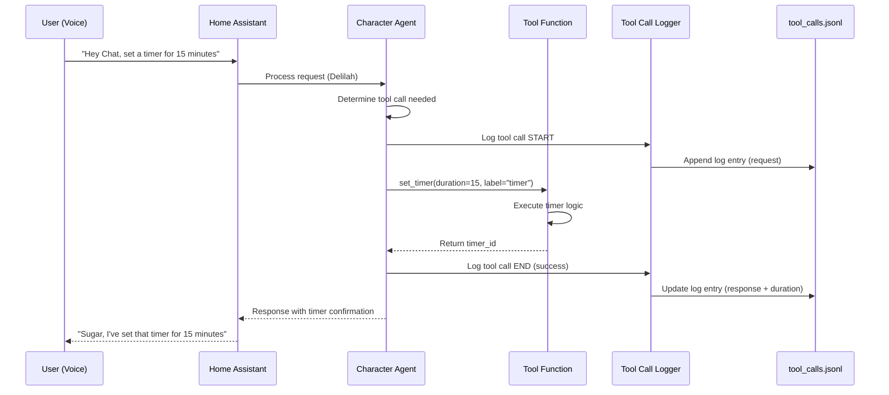

### Memory Retrieval in Context Flow

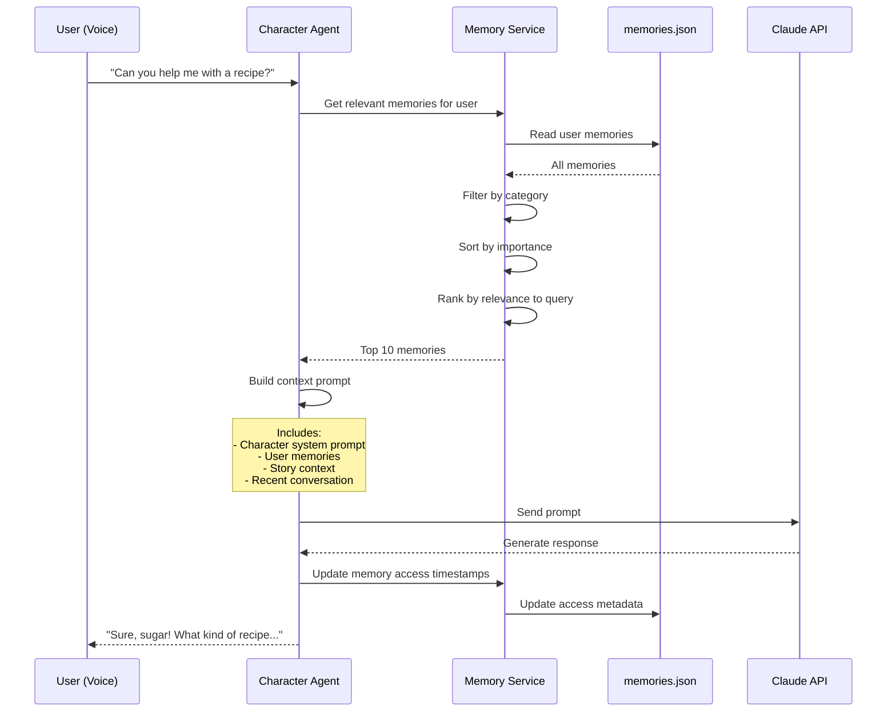

### Chapter Transition Flow

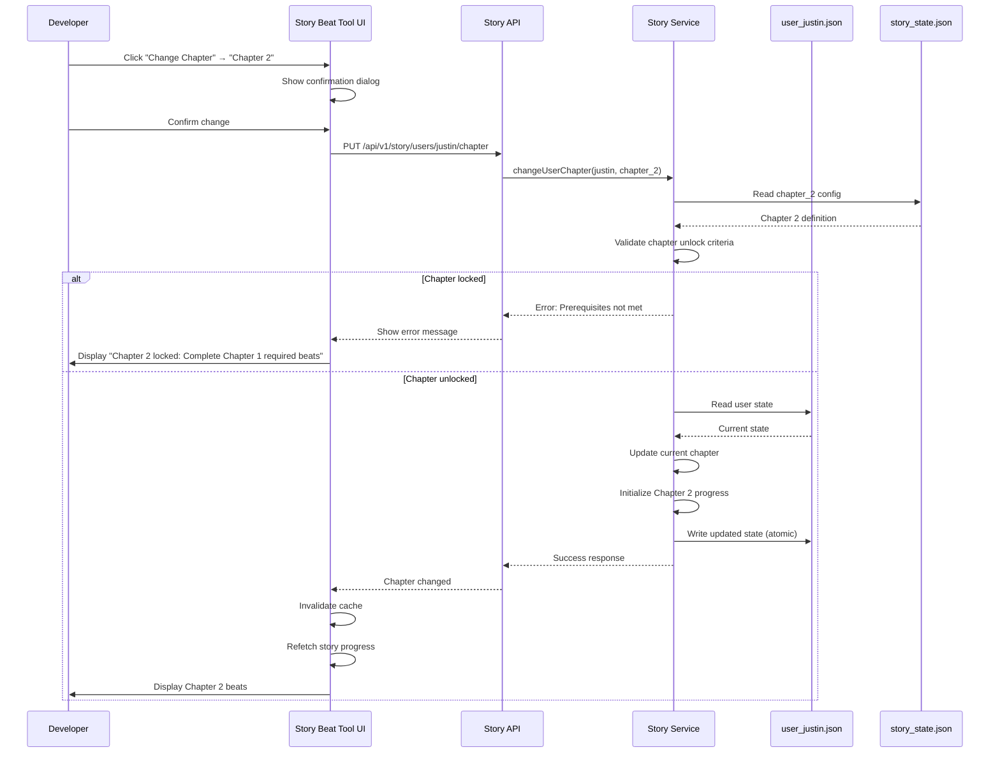

---

## User Workflows

### Workflow 1: Debug Story Beat Not Triggering

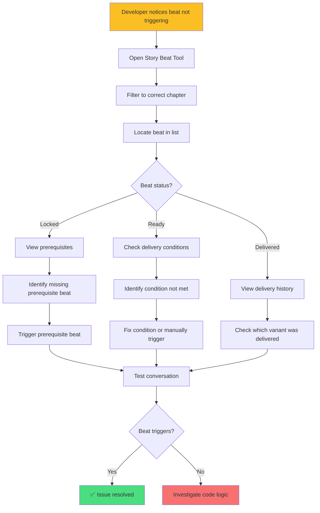

### Workflow 2: Test Chapter Progression

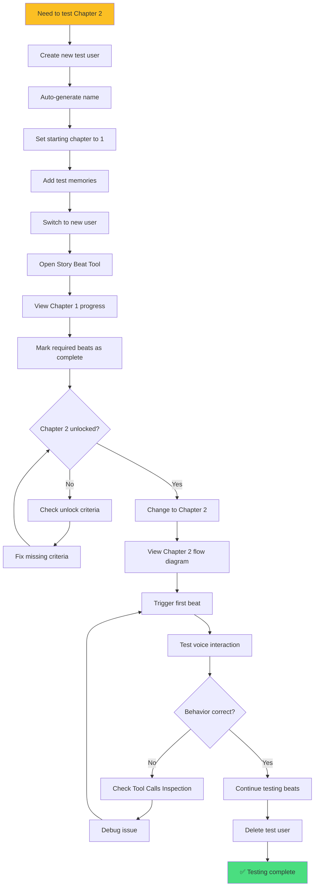

### Workflow 3: Investigate Performance Issue

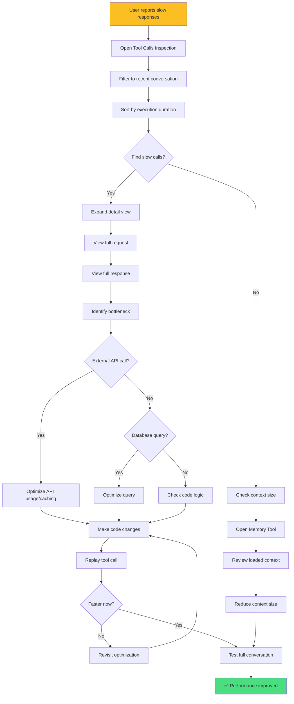

---

## Color Palette & Design System

### Color Scheme (Dark Mode)

```
Background Colors:
- Primary: #1a1a1a (dark gray)
- Secondary: #2a2a2a (lighter gray)
- Elevated: #333333 (card backgrounds)

Text Colors:
- Primary: #ffffff (white)
- Secondary: #a0a0a0 (gray)
- Muted: #666666 (dark gray)

Accent Colors:
- Blue (Info): #60a5fa
- Green (Success): #4ade80
- Yellow (Warning): #fbbf24
- Red (Error/Delete): #f87171
- Purple (Feature): #a78bfa

Semantic Colors:
- Story Beats: #60a5fa (blue)
- Characters: #a78bfa (purple)
- Memories: #4ade80 (green)
- Tool Calls: #fbbf24 (yellow)
- Users: #f87171 (red)

Status Colors:
- Delivered/Complete: #4ade80 (green)
- Ready/Active: #60a5fa (blue)
- Locked: #666666 (gray)
- Error: #f87171 (red)
- Warning: #fbbf24 (yellow)
```

### Typography

```
Font Family:
- Primary: Inter, system-ui, sans-serif
- Monospace: 'Fira Code', monospace (for code/JSON)

Font Sizes:
- h1: 2rem (32px)
- h2: 1.5rem (24px)
- h3: 1.25rem (20px)
- Body: 1rem (16px)
- Small: 0.875rem (14px)
- Tiny: 0.75rem (12px)

Font Weights:
- Regular: 400
- Medium: 500
- Semibold: 600
- Bold: 700
```

### Spacing System

```
4px units:
- xs: 4px
- sm: 8px
- md: 16px
- lg: 24px
- xl: 32px
- 2xl: 48px
- 3xl: 64px
```

### Component Patterns

#### Cards

- Background: #333333
- Border: 1px solid #444444
- Border radius: 8px
- Padding: 16px
- Shadow: 0 2px 8px rgba(0, 0, 0, 0.2)

#### Buttons

- Primary: Blue (#60a5fa) with hover darken
- Secondary: Gray (#666666) with hover lighten
- Danger: Red (#f87171) with hover darken
- Padding: 8px 16px
- Border radius: 6px

#### Tables

- Header: #2a2a2a background
- Row hover: #333333 background
- Border: 1px solid #444444
- Zebra striping: alternate row backgrounds

#### Dialogs

- Overlay: rgba(0, 0, 0, 0.7)
- Container: #2a2a2a background
- Max width: 600px
- Border radius: 12px
- Padding: 24px

---

## Responsive Design

### Breakpoints

```
- Mobile: < 640px
- Tablet: 640px - 1024px
- Desktop: > 1024px
```

### Layout Adaptations

**Mobile:**

- Single column layout
- Collapsible sidebars
- Full-width cards
- Stacked action buttons

**Tablet:**

- Two-column layout where appropriate
- Side-by-side filters and actions
- Larger touch targets

**Desktop:**

- Three-column layouts for list-detail views
- Sidebars always visible
- Compact spacing
- Keyboard shortcuts enabled

---

## Accessibility

### Compliance Goals

- WCAG 2.1 AA compliance
- Keyboard navigation for all interactions
- Screen reader support
- High contrast mode support
- Focus indicators visible

### Implementation

- Semantic HTML5 elements
- ARIA labels for complex interactions
- Sufficient color contrast (4.5:1 minimum)
- Skip links for keyboard users
- Error messages announced to screen readers

---

## Animation & Interactions

### Transition Timing

```
- Fast: 150ms (hover states, button clicks)
- Medium: 250ms (panel opens, modal shows)
- Slow: 350ms (page transitions, large animations)

Easing: cubic-bezier(0.4, 0.0, 0.2, 1)
```

### Interaction Patterns

**Loading States:**

- Skeleton screens for initial load
- Spinners for quick operations (<2s)
- Progress bars for long operations (>2s)

**Success/Error Feedback:**

- Toast notifications (auto-dismiss after 3s)
- Inline validation messages
- Success checkmarks with animation

**Hover States:**

- Subtle background color change
- Border highlight
- Shadow increase

---

*This visual design document will evolve as implementation progresses and usability testing reveals improvements.*
